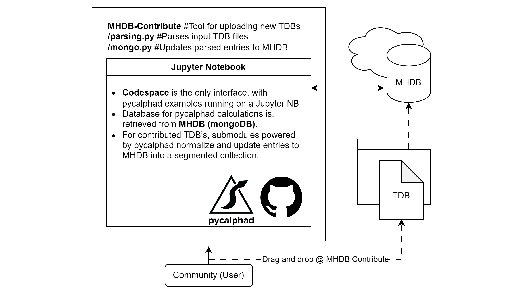

# Metal Hydrides Database (MHDB)

MHDB is a comprehensive suite designed to facilitate thermodynamic calculations and provide shared access to thermodynamic databases related to Metal Hydrides for H2 storage. This project aims to provide a structured and efficient way to explore and manage data about metal hydrides, including the calculation of relevant physical properties such as H2 decomposition temperature, H2 equilibrium vapor pressure, phase diagrams, and more.

## Features

- Web browser setup for thermodynamic calculations using pycalphad.
- User-defined thermodynamic conditions and systems integrating both uploaded and built-in data.
- Open access to the curated MHDB database, compatible across multiple hydride system.
- Open access to the community MHDB database, with individual system assessments and reference tools.
- Open-source code readily available in the repository.

## Getting Started

1. To start, simply open this repository in a GitHub Codespace by clicking on the button below:

2. Once your Codespace environment finishes loading, navigate to the 'notebooks' directory on the left panel and open the Jupyter notebook of your interest.
3. Follow and execute the notebook cells to get familiar with and perform the thermodynamic calculations.
4. To use your own data from .tdb files, please check our `how to contribute` section below.

## How to Contribute

MHDB is an open-access project built on the FAIR principles of Findability, Accessibility, Interoperability, and Reusability and is distributed under the MIT license, with all modules and pieces of code readily available in the repository. If you have your own thermodynamic databases, you are encouraged to contribute by uploading your .tdb files through our [MHDB Contribute](https://github.com/PhasesResearchLab/MHDB/issues/new?assignees=&labels=newTDB&projects=&template=mhdb-contribute.md&title=%5BMHDB+Contribute%5D) tool. Uploaded files will be parsed and integrated into the community database, wherein the references to your work will be readily available for anyone interested in the field.

## Technologies Used

- MongoDB: Used for database management.
- pycalphad: Used for thermodynamic calculations.
- GitHub Codespaces: Used for environment setup.
